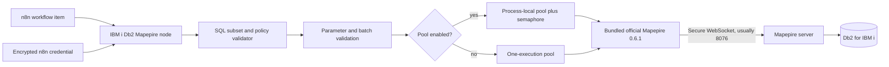
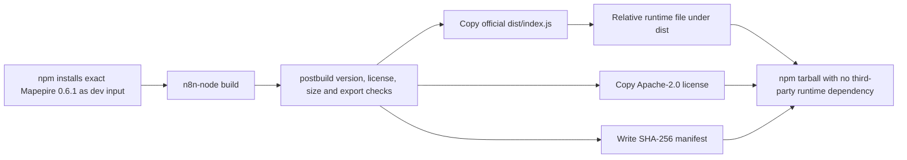

# Architecture



## Build-time vendoring



The source imports Mapepire declarations only as TypeScript types. Runtime code
loads `./vendor/mapepire-js.cjs`, so the installed n8n package does not resolve
an external `@ibm/mapepire-js` module.

## Connection lifecycle

With pooling enabled, one pool is cached per unique credential configuration in
each n8n process. A semaphore limits simultaneous executions to the configured
pool size and applies the configured wait timeout.

With pooling disabled, every execution creates a one-connection pool and closes
it in `finally`.

Queue workers and horizontally scaled n8n instances maintain independent pools.
Estimate IBM i SQL jobs as:

```text
pool size × number of n8n processes executing that credential
```

## Failure behavior

- SQL or policy errors are not retried.
- A transport-level SELECT failure can invalidate the pool and retry once.
- INSERT, UPDATE, and CREATE TABLE are never retried.
- A failed pool-initialization promise is evicted from the cache so a later
  execution can reconnect.
- A write transport error may have occurred after Db2 committed; reconcile the
  target data before manual repetition.
