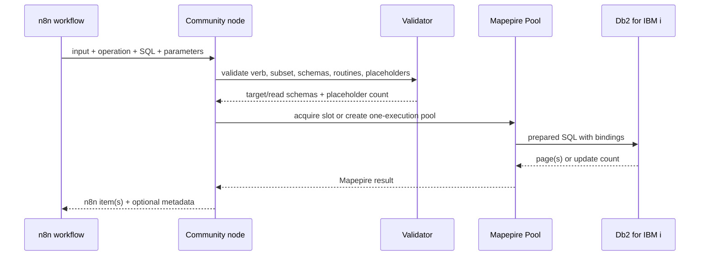

# Architecture

```mermaid
flowchart LR
  W[n8n workflow item] --> N[IBM i Db2 Mapepire node]
  C[Encrypted IBM i Mapepire credential] --> N
  N --> V[SQL subset and policy validator]
  V --> L[Parameter and batch limiter]
  L --> P{Pool enabled?}
  P -->|yes| MP[Process-local Pool + semaphore]
  P -->|no| EP[One-execution Pool]
  MP --> M[@ibm/mapepire-js 0.6.1]
  EP --> M
  M -->|secure WebSocket, default 8076| S[Mapepire server]
  S --> D[(Db2 for IBM i)]
```

## Execution sequence



## Connection lifecycle

With `MAPEPIRE_POOL_ENABLED=true`, one pool is cached per unique credential
configuration in each n8n process. A semaphore limits simultaneous work to
`MAPEPIRE_POOL_SIZE`, with `MAPEPIRE_POOL_WAIT_SECONDS` as the queue timeout.

With pooling disabled, every node execution initializes a size-one pool and
closes it in `finally`.

Queue-mode workers and horizontally scaled instances have independent pools.
The maximum IBM i SQL job estimate is therefore:

```text
pool size × n8n processes that execute this credential
```

## Failure behavior

A SELECT transport failure can invalidate the process-local pool and retry once.
A write never retries because the transport can fail after Db2 commits. The
workflow receives the error and must reconcile the target data before deciding
to repeat the operation.
